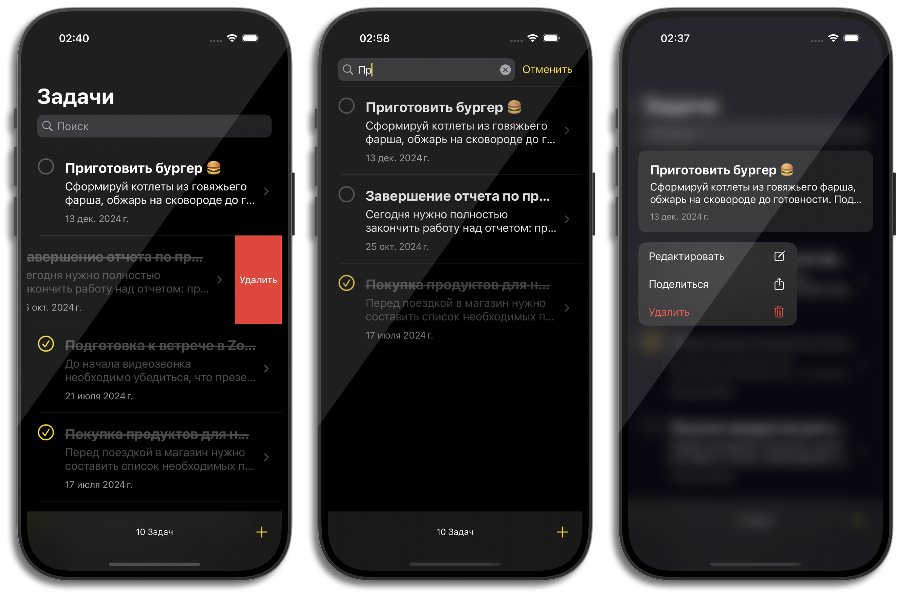
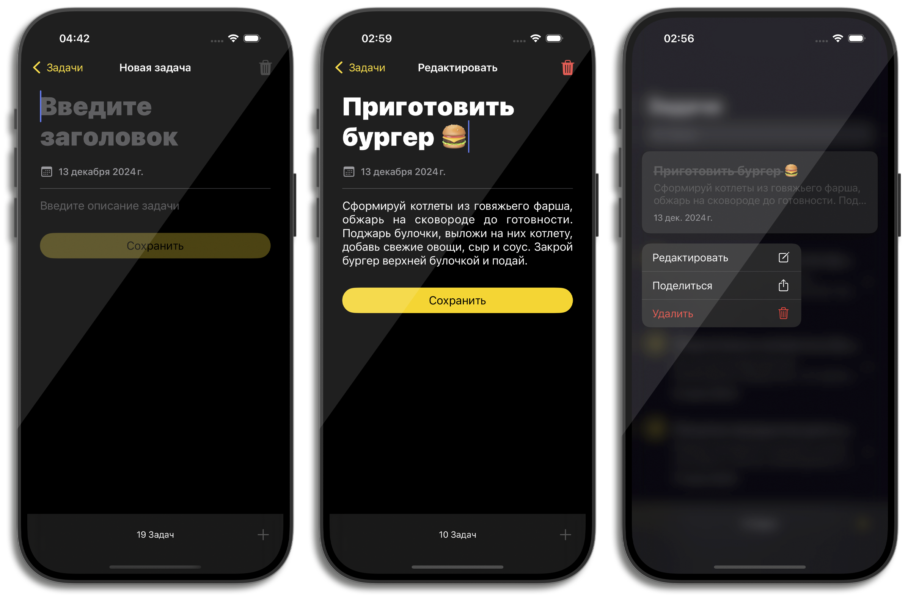

# iTask


## 🚀 Overview
iTask is a simple and efficient task management app built entirely programmatically using VIPER architecture. It leverages UIKit and Core Data for managing tasks and data persistence. No Storyboards or XIBs are used — everything is built with code!

## No Storyboards or XIBs ❌

This project is implemented entirely programmatically without using Storyboards or XIB files.

## 🔧 Architecture:
- VIPER


## 📝 Language and Frameworks:
- Language
  - Swift 

- Frameworks:
  - UIKit
  - Core Data

## 📦 Data Storage:
  - Core Data

## 🌍 Localization

The application is localized for the following languages:

- English 
- Russian 
  
## 🚧 Clone:
   ```bash
   git clone https://github.com/alvdalen/iTask-VIPER-UIKit
   ```

## 📸 Screenshots (iPhone 16 Pro)



## ✨ Features
- Create, update, and delete tasks.
- Store tasks locally using Core Data.
